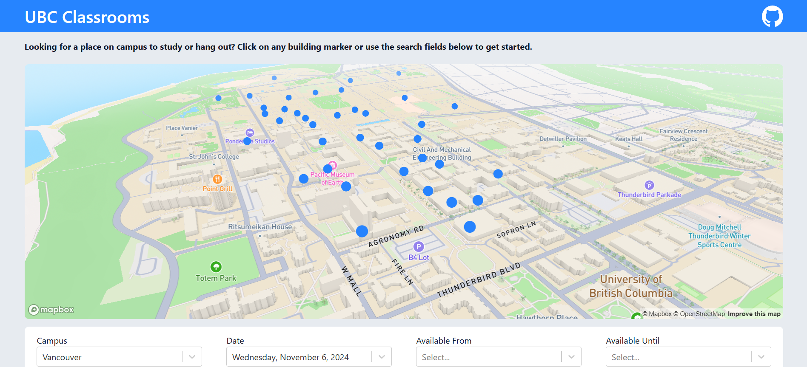

# UBC Classrooms - [ubcclassrooms.ca](https://ubcclassrooms.ca)

UBC Classrooms is a tool for finding empty classrooms across UBC at specific times. The project uses React, Django and PostgreSQL, with nginx as the web server and Cloudflare as the DNS provider. The map view is provided by the Mapbox GL JS library. Deployments are made through GitHub Actions and Docker Hub.



Frontend project structure was inspired by [Bulletproof React](https://github.com/alan2207/bulletproof-react?tab=readme-ov-file#bulletproof-react-%EF%B8%8F-%EF%B8%8F).

## Instructions for running the application locally

For some debugging hints, [refer to the debugging section](#debugging)

1. Ensure that the following dependencies are installed:
   - [Git](https://git-scm.com/downloads)
   - [Node.js v20+](https://nodejs.org/en/download/package-manager)
   - [Cisco AnyConnect Secure Mobility Client](https://it.ubc.ca/services/email-voice-internet/myvpn/setup-documents)
   
   Linux:
   - [Docker Engine and CLI](https://docs.docker.com/engine/install/)
   - [Docker Compose](https://docs.docker.com/compose/install/)
   
   Windows:
   - [Docker Desktop for Windows](https://docs.docker.com/desktop/install/windows-install/)
   
   macOS:
   - [Docker Desktop for Mac](https://docs.docker.com/desktop/install/mac-install/)

   You will also need [Duo Mobile](https://duo.com/product/multi-factor-authentication-mfa/duo-mobile-app) for MFA to connect to UBC VPN, and a [Mapbox account](https://www.mapbox.com/) to access the map view.

2. Clone the repo to your desired directory using the command line (Git Bash for Windows/macOS)
   
    ```bash
    $ # Create a new directory to clone the repo to (replace "projects/ubc-classrooms" with whatever path you wish, or skip this step if your desired directory exists already)
    $ mkdir -p projects/ubc-classrooms
    $ # Set the working directory (replace "projects/ubc-classrooms" with the path to your desired directory)
    $ cd projects/ubc-classrooms
    $ # Clone the repo into the directory (directory must be empty)
    $ git clone https://github.com/JeffreyJPZ/ubc-classrooms.git .
    ```
    
3. Create a `dev.env` file in the project's root directory with the following variables:

   ```
   SQL_ENGINE=django.db.backends.postgresql
   SQL_DB=ubc_classrooms_dev
   SQL_DB_TEST=ubc_classrooms_test
   SQL_USER=default
   SQL_PASSWORD=default
   SQL_HOST=db
   SQL_PORT=5432
   DB=postgres
   DEBUG=True
   DJANGO_ALLOWED_HOSTS=*
   DJANGO_DEV_SECRET_KEY='django-insecure-$^pvra=ndps97#a#ei#*8(h%_jbs3#&4inla2!(l^x+ry62dat'
   USER_OS=<USER_OS_GOES_HERE>
   PATH_TO_DOCKER_DESKTOP_EXECUTABLE=<PATH_TO_DOCKER_DESKTOP_EXECUTABLE_GOES_HERE>
   PATH_TO_CISCO_ANYCONNECT_EXECUTABLE=<PATH_TO_CISCO_ANYCONNECT_EXECUTABLE_GOES_HERE>
   CWL_USERNAME=<CWL_USERNAME_GOES_HERE>@app
   CWL_PASSWORD=<CWL_PASSWORD_GOES_HERE>
   ```

   NOTE:
   - Replace **<USER_OS_GOES_HERE>** with one of WINDOWS, MACOS, or LINUX
   - If **<USER_OS_GOES_HERE>** is WINDOWS or MACOS, replace **<PATH_TO_DOCKER_DESKTOP_EXECUTABLE_GOES_HERE>** with the absolute path to your Docker Desktop executable
      - Windows Example: '/c/Program Files/Docker/Docker/Docker Desktop.exe' (must use single quotes)
   - Replace **<PATH_TO_CISCO_ANYCONNECT_EXECUTABLE_GOES_HERE>** with the absolute path to the Cisco AnyConnect executable
      - Windows Example: '/c/Program Files (x86)/Cisco/Cisco AnyConnect Secure Mobility Client/vpncli.exe' (must use single quotes)
      - Linux Example: '/opt/cisco/anyconnect/bin/vpn' (must use single quotes)
   - Replace **<CWL_USERNAME_GOES_HERE>** and **<CWL_PASSWORD_GOES_HERE>** with your CWL username and password
      - Username Example: 'user' (must use single quotes)
      - Password Example: 'pass' (must use single quotes)

4. Generate a Mapbox token and copy it to a `.env.development` file in the `frontend` directory as follows:
   ```
   VITE_MAPBOX_DEV_ACCESS_TOKEN='<USER_TOKEN_GOES_HERE>'
   ```
   Ensure that the token is surrounded with quotes.

5. Run the setup script from the project's root directory, authenticating as needed.

   Bash:
   
      ```bash
      $ ./setup.sh
      ```
   
   Windows Command Prompt or Powershell:
   
      ```cmd
      .\setup.bat
      ```


6. Start the required services:
   
    ```bash
    $ # Start the web and database services in detached mode
    $ docker compose -f compose.dev.yml up db web -d
    ```

7. Run the application
   
    ```bash
    $ # Navigate to the UBC Classrooms web application
    $ cd frontend
    $ # Install the required dependencies
    $ npm ci
    $ # Run the application in development mode
    $ npm run dev
    ```

8. Access the application at http://localhost:3000/

9. To stop the application and reclaim disk space, do the following:
   
    - Press CTRL + C to stop the application and regain control of the command line
    - Run the following commands:
    
      ```bash
      $ # Stops the services
      $ docker compose -f compose.dev.yml down
      $ # Removes services and other utilities, frees up disk space from dangling images
      $ # Use the -a flag to remove everything i.e. "docker system prune -a"
      $ docker system prune
      ```

## Debugging:
- If you encounter "permission denied" errors especially on Linux, you may want to prefix all commands with "sudo"
- If you encounter "[file] not executable" errors, try running "chmod u+x [file]"
- For some Linux distributions, if "systemctl" is not installed, replace the command with "service" in `setup.sh`
